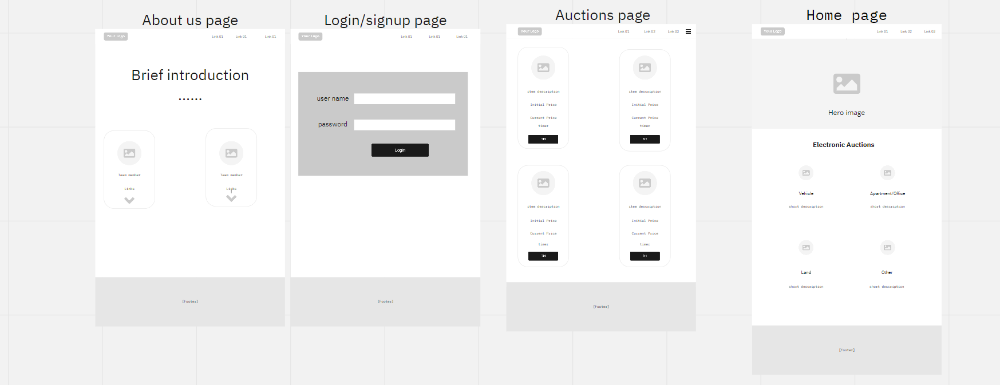

# Auction

Auction website allows the user to buy or sell any product they want, the user can put products in both ; used products or new products like (cars,furniture,laptops,photos,split units AC,apartment etc..) to sell them by the website . The user who want to sell his product , should upload a photo for the product ,description,minimum bidding,minimum price,time, and method for payment),The user who wants to buy or bid  on any product must fill an agreement form to ensure they have money and follow the policies for the website .

## Team Members

* Rawan Alakhras
* Dawood Basher
* Mohammed Abu farweh
* Aya abu dagar
* Khalil Ghanem

# wireframes

# User Stories

#### Feature One

* As a user I want to be able to signup

* Feature Tasks:
  * Create a form to signup
  * add user name and all info in the form to signup
  * redirect user in login page

#### Feature Two

 As a user I want to be able to login

* Feature Tasks:
  * Create a form to login
  * Show the user page and information
  * Show product with full description and images.

#### Feature Three

As a user I want to be able to share my own product  with other users, so I would like to sale it .

* Feature Tasks:
  * Create a form to add product details.
  * Give the user the ability to add images to the product.
  * Show product with full description and images.

#### Feature four

As a user I want to buy some product from this website .

#### Feature Tasks

* Create a form to add my price.
* Give the user the ability to raise the price.
* Show the user the highest price he got

#### Feature five

As a user i want the website to have amazing designs, and also some animations to be included as well.

* Feature Tasks:
  * Design the website with suitable colours, layout and display.
  * Add animation in some of the pages .
